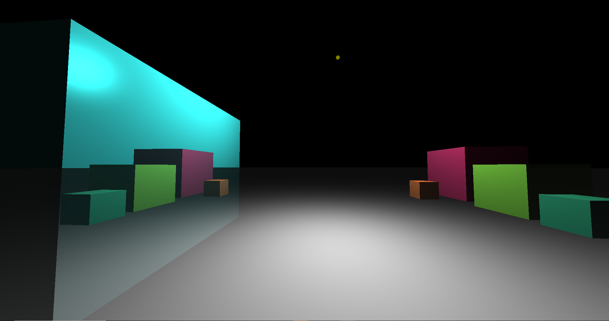

# Raytracer
Raytracer written in C++ with OpenGL and GLSL.

A quad is rendered to the screen using opengl. Then the scene is drawn onto the quad inside a fragment shader. The scene is rendered entirely using raytracing, and features reflections up to any arbitrary n bounces, as well as ambientm specular and diffusion lighting effects.

To build the repo just run build.ps1. This will build the executable Raytracer.exe in the project folder.

## Youtube Video

